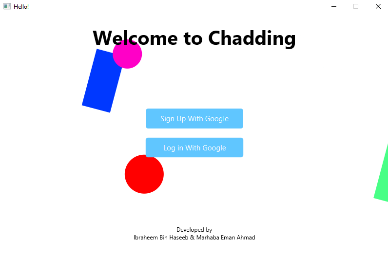
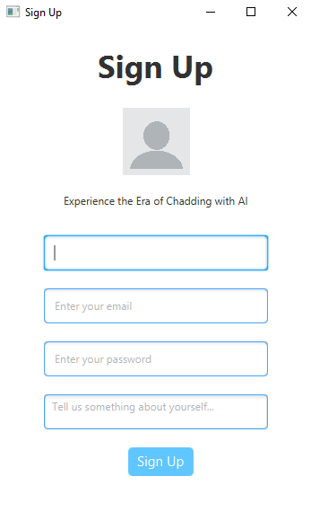
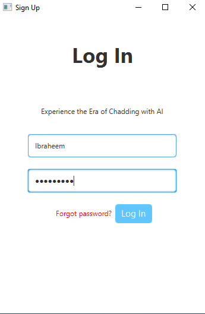
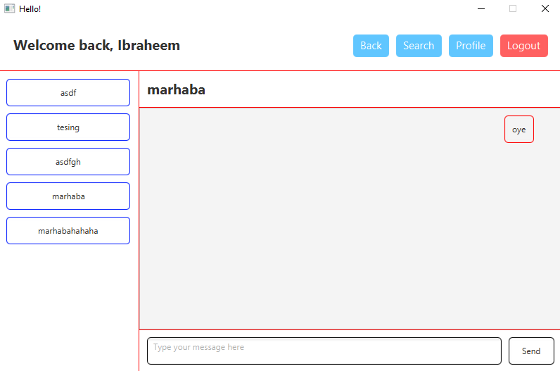
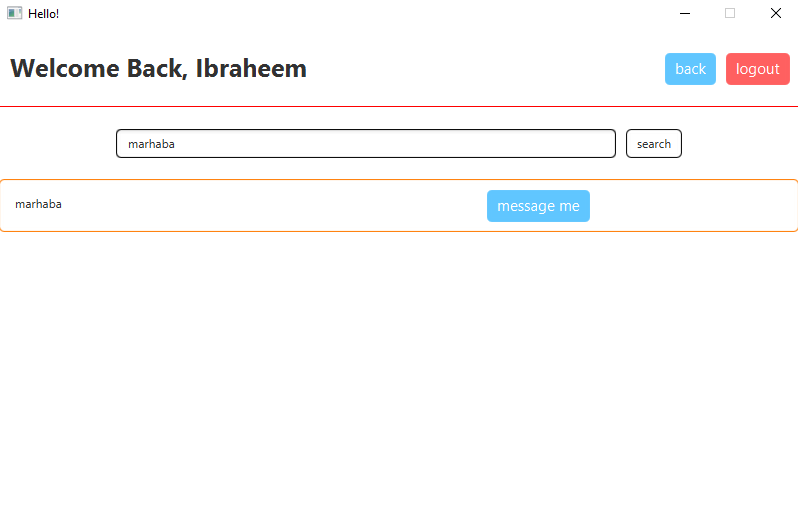
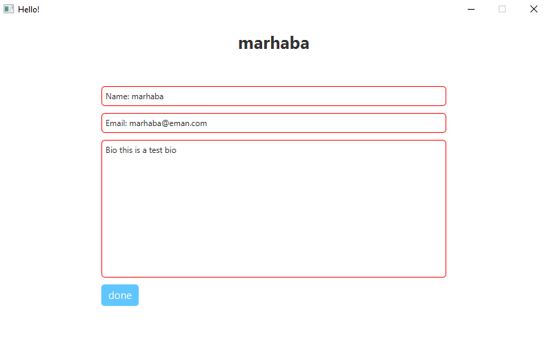

# Chatting Application

This application was developed with `JavaFX` for frontend where as we used `Firebase` for the backend which was used for the user authentication as well as the database to store the chats in the form of `Firestore`.

Below are some screenshots attached with the application to give you an idea of the application itself.

## Start Up Screen


## Sign Up Page


## Login Page


## Home Screen


## Search Screen


## Profile Screen


## Project Partners
```
Ibraheem Bin Haseeb
Marhaba Eman Ahmad
```

